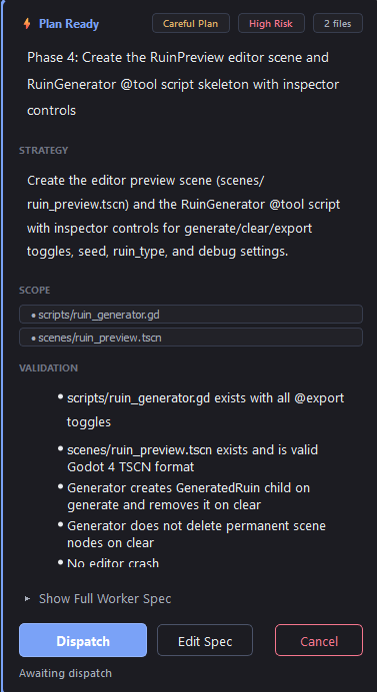
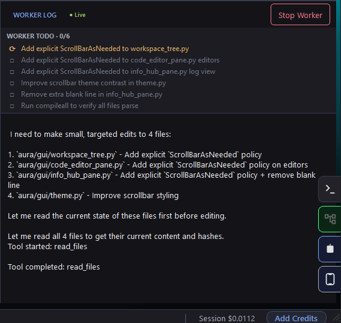
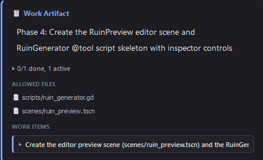
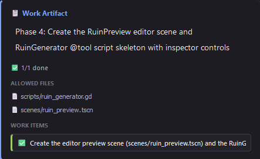

# Aura IDE

[](https://www.python.org/)
[](LICENSE)
[](https://github.com/CarpseDeam/Aura-IDE/releases/latest)
[](https://discord.gg/aGSthBX2Bg)

**Bring any model. Aura makes it plan, prove, and validate its work.**

Aura is an open-source desktop coding harness. Aura turns AI coding into a visible loop: approve the plan, review the diff, run validation, keep the receipt.

**Chat is where the model talks. Aura is where the model works.** The Planner inspects your workspace and prepares the job, you approve it, and the Worker executes bounded changes against the real files on your desktop.

[Website](https://carpsedeam.github.io/Aura-IDE/) · [Download](https://github.com/CarpseDeam/Aura-IDE/releases/latest) · [Start Here](https://aura-ide.hashnode.dev/start-here) · [Documentation](docs/README.md) · [Discord](https://discord.gg/aGSthBX2Bg) · [Blog](https://aura-ide.hashnode.dev/)

<p align="center">
  
</p>

<p align="center"><em>Completed work remains inspectable — keep the completion receipt.</em></p>

## The visible loop

```text
Ask → Plan → Dispatch → Review → Validate → Done
```

- **Ask** — Describe the change in plain language.
- **Plan** — Planner inspects the workspace and prepares a focused spec.
- **Dispatch** — You approve the plan before bounded work begins.
- **Review** — Proposed writes appear as readable diffs.
- **Validate** — Aura runs checks suited to the project and changed files. Failures remain visible and clearly reported.
- **Done** — Completed work leaves an inspectable receipt.

Planning and execution are separate on purpose: the model gets a concrete job, and you keep a review point before work reaches the workspace.

## Product proof

These are real states from the current Aura desktop workflow.

### Approve the work before execution

<p align="center">
  
</p>

The Plan Ready card keeps strategy, allowed scope, validation expectations, and dispatch control together.

### Watch bounded work advance live

<p align="center">
  
</p>

Worker TODO and Worker Log expose the active item, tool activity, progress, and session status while the job runs.

### Keep file scope visible

<p align="center">
  
  
</p>

The WorkArtifact retains the job, allowed files, and item state from active execution through completion.

### Review every proposed change

<p align="center">
  
</p>

The completed cockpit shown at the top keeps the WorkArtifact, Worker TODO, files, validation outcome, and completion receipt inspectable after the run.

## Quick start

### Windows installer

Download the latest `.exe` from [GitHub Releases](https://github.com/CarpseDeam/Aura-IDE/releases/latest). Aura installs per user, requires no administrator rights, and handles Windows application updates in-app.

### From source

Use the source install on macOS, Linux, or Windows with Python 3.10 or newer:

```bash
git clone https://github.com/CarpseDeam/Aura-IDE.git
cd Aura-IDE
pip install .
aura
```

### First run

1. Open a workspace.
2. Configure your own provider key, or choose optional Aura Credits.
3. Ask for a small task such as `fix a typo in README.md`.
4. Review the Planner's spec.
5. Dispatch the approved work.
6. Review proposed diffs and visible validation results.
7. Inspect the completion receipt.

See [Getting Started](docs/getting-started.md) for onboarding, model setup, shortcuts, and the full first-run walkthrough.

## Built with Aura

Aura wrote most of itself through the same harness loop. From May to June 2026, it processed **2+ billion DeepSeek tokens** across nearly **30,000 API requests** while building its own codebase.

These figures are supporting evidence for sustained harness-driven development—not the product pitch by themselves.

<p align="center">
  
  
</p>

## Why Aura is different

- **Planner and Worker separation** — the Planner researches and specifies; the Worker executes the approved job. Each role can use a different model, provider, or thinking depth.
- **Repo-aware context** — language-aware code intelligence, local BM25 search, dependency context, project metadata, and targeted file reads give each role more than the latest chat message.
- **WorkArtifact-bounded execution** — every approved dispatch becomes one WorkArtifact. Flat work is a one-item artifact; multi-step work is a multi-item artifact advanced internally through the same execution path, without creating new SpecCards for internal items.
- **Reviewable diffs** — proposed file writes can be inspected and approved before they reach disk.
- **Project-aware validation** — Aura detects project tooling, selects focused checks for changed files, and reports results without hiding failures.
- **Inspectable receipts** — completed runs retain tool, file, validation, cost, and outcome information as an audit record; receipt status does not drive internal item state.
- **Provider flexibility** — choose providers independently for Planner and Worker, including a mix of BYOK and optional Aura Credits.
- **Local-first control** — the desktop owns the real workspace, execution, keys, and approval surface.

### The harness effect

Lower-cost models become more useful when the workflow supplies planning, scope, review, validation, and receipts. Stronger models benefit from the same control surface. The model changes; the visible loop stays consistent.

## Safety and control

Aura treats model-generated changes like a teammate's pull request. The controls are concrete and configurable:

- **Diff approval** — write tools produce a unified diff before mutation when approval is enabled. Approve or reject one change, or handle the remaining batch together.
- **Automatic backups** — existing files are copied to `.aura/backups/` before write operations.
- **Read-only mode** — write tools are removed from the model's tool list at the registry level.
- **Bounded scope** — WorkArtifacts keep the current item and allowed files visible; Drones can add explicit write policies and path limits.
- **Visible validation** — commands, outcomes, missing tools, and failures remain available for inspection.
- **Git safety tools** — status, diff, commits, snapshots, restore support, and `/undo` are built into the workflow.
- **Encrypted API keys** — saved keys use machine-derived Fernet encryption; environment variables are also supported.

These controls reduce risk, but they do not replace reviewing the plan, diffs, and validation output. See [Safety & Control](docs/safety.md) for details.

## Aura Companion

**Your phone steers Aura. Your desktop does the work.**

Companion is a remote control, not a separate IDE. The desktop owns the workspace and execution; the phone can browse projects and conversations, message the Planner, dispatch approved work, follow live execution, check Drone status, and inspect receipts.

<p align="center">
  
  
</p>

Enable Companion on the desktop, pair from the phone browser, and connect through a local or hosted relay. The desktop must remain running. See [Mobile Companion](docs/mobile.md) for setup and connection details.

## Drones

**Drones are saved robot chores for repeatable work.**

- Save a repeatable project job instead of explaining it again.
- Run it on demand or on a schedule.
- Apply read-only or write-approval policies and bounded execution rules.
- Keep a receipt from each run.

Drones are useful for recurring research, maintenance, checks, and other project tasks where the job should remain consistent across runs.

<details>
<summary>Developer details</summary>

Each Drone is folder-backed and defined by a `drone.json` manifest.

- **Command Drones** launch an entrypoint, receive one JSON object on stdin, and return one JSON object on stdout.
- **Harness-lap Drones** run a bounded job through Aura's Planner/Worker harness.
- Write policies include `read_only`, `ask_before_writes`, and `normal_diff_approval`.
- Read-only Drones can run in parallel; write-capable Drones share a single write lane so approval flows do not compete.
- Run receipts are stored per workspace under `.aura/drones/runs/`.

See [Drones](docs/drones.md) for manifest fields, execution contracts, policies, and construction rules.

</details>

## BYOK and Aura Credits

**BYOK is first-class and forever. Aura Credits are optional convenience.**

### Bring Your Own Keys

Connect directly to **DeepSeek**, **OpenAI**, **Anthropic**, **Gemini**, or **OpenRouter**. Your key, your provider billing, and your choice of models remain under your control. Keys can be supplied through Settings or environment variables.

### Aura Credits

Aura Credits are an optional pay-as-you-go path for starting without provider key setup. They are not a subscription and are not required to use Aura.

Planner and Worker are configured independently, so you can use different BYOK providers for each role or mix BYOK with Credits. See [Providers](docs/providers.md) for supported backends and configuration details.

## Advanced capabilities

- **Repo-aware code intelligence** — language-aware outlines, symbol and reference lookup, project structure, and a local BM25 code index.
- **Dependency context** — reverse-reference and dependency hints help define the likely blast radius of a change.
- **Project-aware validation** — project profiles, syntax probes, focused terminal checks, and changed-file context guide validation.
- **Run-and-watch verification** — start a process, observe its output over a bounded window, and retain the result.
- **Git integration** — status, diff, commit, snapshots, restore support, `/undo`, and automatic `.aura/` ignore setup.
- **Web research** — an Aura-owned browser controller and read-only research Drone support sourced external research when a task needs current information.
- **MCP integration** — connect stdio Model Context Protocol servers and expose their tools through Aura's tool registry.
- **Update support** — packaged Windows builds support in-app updates, while source checkouts can inspect upstream update state.

The [documentation index](docs/README.md) links to architecture, tools, providers, configuration, safety, Companion, and development references.

## Community and support

- [Website](https://carpsedeam.github.io/Aura-IDE/) — the short product tour and current visual workflow.
- [Documentation](docs/README.md) — installation, architecture, tools, providers, safety, and development guides.
- [Blog](https://aura-ide.hashnode.dev/) — build logs, design notes, and project updates.
- [Discord](https://discord.gg/aGSthBX2Bg) — help, bug reports, feedback, and show-and-tell.
- [GitHub Issues](https://github.com/CarpseDeam/Aura-IDE/issues) — reproducible bugs and feature requests.

Aura is free and open source. If it is useful to you, support helps cover infrastructure, packaging, and continued development:

[GitHub Sponsors](https://github.com/sponsors/CarpseDeam) · [Buy Me a Coffee](https://buymeacoffee.com/snowballkori)

MIT License — see [LICENSE](LICENSE).
