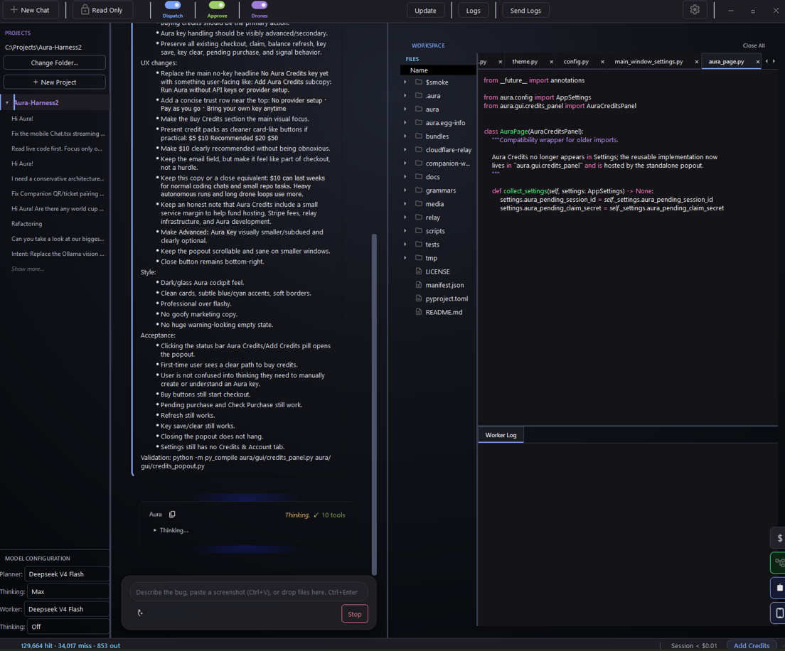
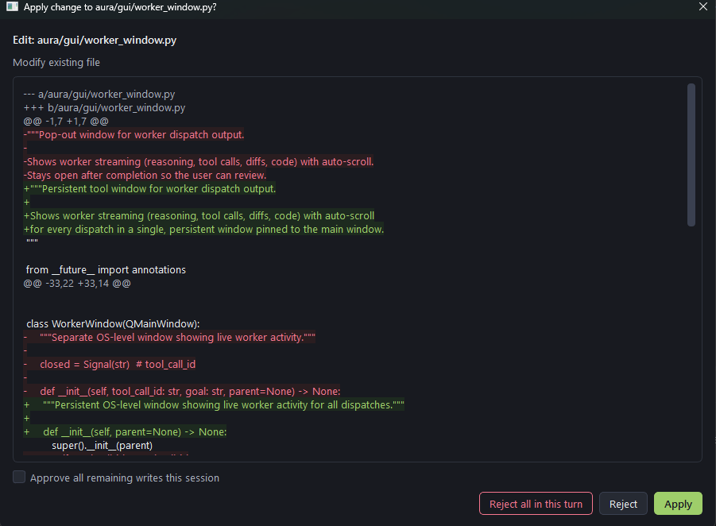
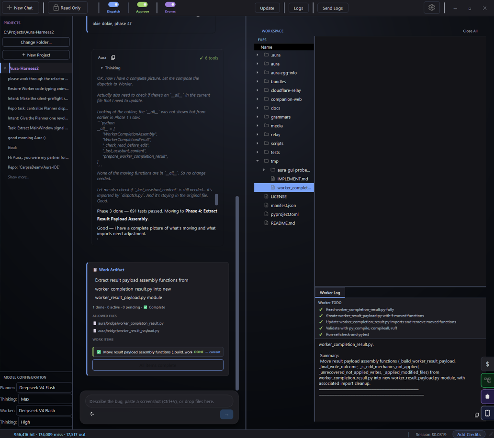
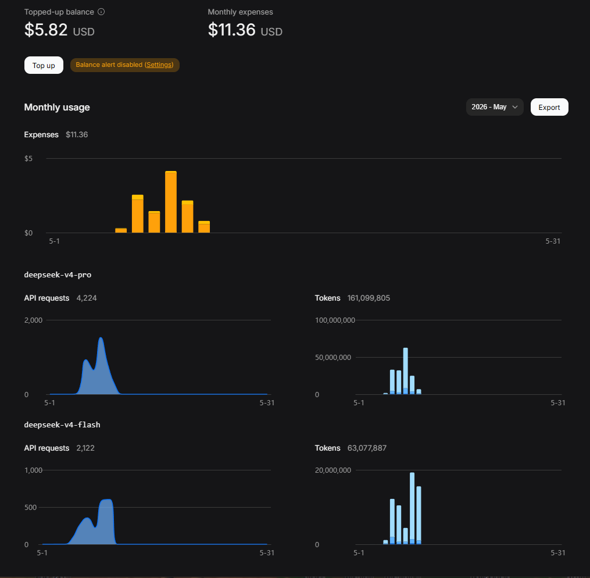
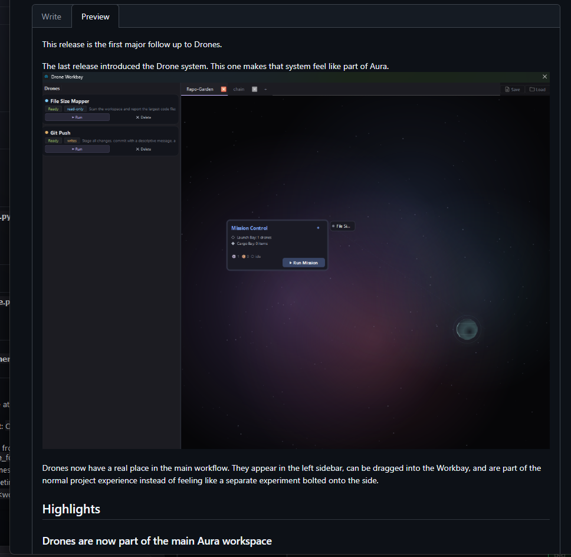

# Aura IDE

[](https://www.python.org/)
[](LICENSE)
[]()
[](https://discord.gg/aGSthBX2Bg)
[](https://github.com/CarpseDeam/Aura-IDE/releases/latest)


**Bring any model. Aura makes it plan, prove, and validate its work.**

Aura is an open source desktop coding harness that makes any model better at coding than it is alone. It plans before writing, edits through reviewable diffs, validates the result, recovers or aborts cleanly when validation fails, and leaves receipts for every run. You bring your own keys, choose your providers, and keep full control of your repo and workspace.

[Start Here](https://aura-ide.hashnode.dev/start-here) · [Download](https://github.com/CarpseDeam/Aura-IDE/releases/latest) · [Discord](https://discord.gg/aGSthBX2Bg) · [Build Log](https://aura-ide.hashnode.dev/) · [Support](https://buymeacoffee.com/snowballkori)

<p align="center">
  
</p>

---

## The core loop

**AI coding agents need receipts, not vibes.**

```
Ask → Plan → Dispatch → Review → Validate → Done.
```

Most AI coding tools are black boxes — they edit files directly with no intermediate reasoning, no diff review, and no validation. You cross your fingers and hope the output is correct.

Aura works differently. Every change is visible, reviewable, and verifiable.

- **Ask** — tell Aura what you want done in your repo.
- **Plan** — the Planner reads your workspace and writes a structured spec before any code is touched. You see the plan, you approve it.
- **Dispatch** — send the approved spec to the Worker.
- **Review** — the Worker executes through controlled file tools. Every proposed edit shows as a unified diff. Approve or reject before anything touches disk.
- **Validate** — checks run after every change. If something breaks, the Worker inspects the error and retries. If recovery fails, the change is aborted cleanly, no broken state.
- **Done** — receipts show every tool call, token cost, and file changed. You know exactly what happened and what it cost.

This is not a chat wrapper. This is a two agent harness with guardrails, visibility, and accountability.

---

## See the workflow

Watch the full loop: the Planner reads your repo, writes a spec, the Worker edits files, validates, and completes.

<p align="center">
  
</p>

The key moments, captured:

<p align="center">
  
</p>

<p align="center">
  
</p>
---

## Built with Aura

Aura wrote most of itself through the same harness loop. During May/June 2026 it processed **2+ billion DeepSeek tokens** across nearly **30,000 API requests** while building its own codebase.

This is proof that the harness delta can turn model output into a real shipping workflow.
<p align="center">
  
  
</p>

---

## Why Aura is different

Most AI coding tools edit files directly with no intermediate reasoning layer. Aura separates concerns and puts you in control.

- **Planner/Worker separation** — two agents, two roles, no confusion. One researches and specs, the other builds and validates.
- **Repo-aware context** — AST repo maps, dependency graphs, BM25 code search, all baked into every Planner prompt. Aura understands your project structure, not just your last message.
- **Diff approval** — every proposed write shows a unified diff before touching disk. Approve, reject, approve all, or reject all.
- **Validation and recovery** — every change is validated. The Worker retries on failure and aborts cleanly if recovery fails. No broken state.
- **Receipts** — tool calls, token costs, files changed. Every run produces a record you can inspect.
- **Provider flexibility** — swap models per role. Use cheaper models when they work and stronger models when needed. DeepSeek, OpenAI, Anthropic, Gemini, OpenRouter, or Aura Credits.
- **Local-first control surface** — your desktop runs everything. Your keys, your workspace, your data.

### The harness effect

Lower-cost models become more useful when wrapped in planning, diff review, validation, and receipts. Stronger frontier models still benefit because the harness catches wrong-target edits, skipped validation, and confident mistakes. The model changes; the workflow stays the same.

---

## Quick start

**Windows:** Download the latest installer from [Releases](https://github.com/CarpseDeam/Aura-IDE/releases). Per-user install, no admin rights needed. In-app updates handled automatically. (macOS and Linux: source install below.)

**From source (all platforms):**
```bash
git clone https://github.com/CarpseDeam/Aura-IDE.git
cd Aura-IDE
pip install .
aura
```

**First run:**
1. Open a workspace (File → Open Workspace).
2. Choose your model path:
   - **BYOK** — open Settings → API Keys and add your key for DeepSeek, OpenAI, Anthropic, Gemini, or OpenRouter. Your key, your billing, your data.
   - **Aura Credits** — click the Credits status pill in the toolbar to open the standalone Credits popout. Buy credits, check your balance, and select Aura as your Planner or Worker provider. No API keys needed.
3. Ask for something small — "fix a typo in README.md" or "add a docstring to this function."
4. Review the Planner's spec, then click dispatch.
5. Approve or reject each diff the Worker proposes.
6. Watch validation run. Review the receipt.

---

## What Aura optimizes for

Aura is built for verified agent work: plan the work, do the work, validate the work, and leave a clear receipt. The core coding loop is designed to be steady, transparent, and trustworthy.

Recent work has improved Worker execution, validation reporting, noisy command handling, project-aware validation, Companion control, Aura Credits, and long-session stability.

---

## Safety and control

Aura treats AI-generated changes like a teammate's pull request. Every change is visible, reversible, and understandable.

- **Diff approval on every write** — every `write_file`, `edit_file`, or `edit_symbol` shows a unified diff before touching disk. Approve, reject, approve all, or reject all.
- **Automatic backups** — existing files are backed up to `.aura/backups/` before any edit.
- **Read-only mode** — prevents all writes at the tool-registry level. The AI cannot even see write tools. Safe for exploration.
- **Validation and recovery** — every change is validated. The Worker retries on failure and aborts cleanly if recovery fails. No broken state left behind.
- **Git safety net** — snapshot/restore for experimental checkpoints, `/undo` to soft-reset the last commit, auto-generated commit messages.
- **Encrypted API keys** — stored with a hardware-derived Fernet key, not plaintext. Environment variables also supported.

---

## Aura Companion

Your phone can steer the desktop harness. Aura Companion turns your phone into a remote command center for your desktop agent. It's a web surface — no app store, no install.

<p align="center">
  
  
</p>

**Pair your phone in seconds.** Enable Companion from the desktop, scan the QR code or enter the pairing ticket on your phone browser, and you're connected. Communication flows through the relay — your phone never needs to be on the same network as your desktop.

**What you can do from your phone:**
- Browse your projects and conversation threads
- Start a new chat — the desktop picks it up and the Planner responds
- Send messages to your Planner mid-conversation
- Dispatch specs so the Worker runs on your desktop
- Watch execution stream live as it happens
- Check drone status and review run receipts

The Companion is a remote control, not a separate IDE. Your desktop does the work. Your phone gives you access when you're away from the keyboard.

---

## Aura Credits and BYOK

Aura gives you two paths to model access. **BYOK is the trust engine — always available, always free.** Aura Credits are optional convenience — useful for starting fast without API key setup.

### Bring Your Own Keys — first-class, forever

Connect directly to the model provider of your choice. Your key, your billing, your data.

Supported providers: **DeepSeek**, **OpenAI**, **Anthropic**, **Gemini**, **OpenRouter**

Set your API key in Settings → API Keys. Keys are encrypted to disk with a hardware-derived key. Environment variables also work (`DEEPSEEK_API_KEY`, `OPENAI_API_KEY`, etc.).

**Mix and match.** Use your own Anthropic key for the Planner and DeepSeek for the Worker. Or use Aura Credits for one and BYOK for the other. Both paths support the full Planner/Worker architecture.

### Aura Credits — optional convenience

Credits are a pay-as-you-go balance that works across all Aura-hosted models. No API keys. No provider accounts. No configuration. Useful when you want to start building immediately.

- Open the Credits popout from the toolbar status pill
- Buy credits
- Select "Aura" as your Planner or Worker provider
- Start building

<p align="center">
  
</p>

<p align="center">
  
</p>

Credits include a small service margin to help cover hosting, the relay, and infrastructure. You always see your balance and session spend in the status bar.

Credits are not required to use Aura. BYOK is always available and always free.

---

## Drones

Drones are reusable automation cards for repeatable repo work. Define a task once, run it anytime.

<p align="center">
  
</p>

Each Drone lives in its own folder with a `drone.json` manifest. Drones appear as cards in Aura's Drone panel, where you can run them, loop them on a timer, or delete them. Every run produces a receipt saved to `.aura/drones/runs/`.

**Two kinds of Drones:**

- **Command Drones** — run a local entrypoint through JSON-stdio. Any language works as long as it reads stdin and writes JSON to stdout. Great for small utility tasks.
- **Harness-lap Drones** — run through Aura's full Planner/Worker loop with guardrails: clean worktree, protected paths, max changed files, rollback on failure. Each lap is one bounded pass.

**Write policies** control what a Drone can do: `read_only` (analysis only), `normal_diff_approval` (changes through the same diff-approval cycle as any Worker), or `ask_before_writes` (per-action approval).

Read-only Drones can run in parallel (up to 3). Write-capable Drones use a shared write lane and run one at a time.

Drones are advanced repeatable automation — they make sense once the core harness workflow is familiar.

---

## Advanced capabilities

- **AST repo map** — structural workspace map from Python AST parsing, included in every Planner system prompt.
- **Dependency graph** — import-tree traversal for blast radius analysis. Know what breaks before you change it.
- **BM25 codebase search** — full-text semantic search across 30+ file extensions and up to 1,500 files.
- **Run-and-watch verification** — the Worker can start a process, observe its output over a configurable window, and classify the result.
- **Git integration** — status, diff, commit, undo, snapshot/restore, automatic `.gitignore` setup.
- **Web research** — built-in sub-agent for live web lookups during planning.
- **MCP tool integration** — connect custom stdio MCP servers. Tools are auto-converted to OpenAI-compatible function schemas.
- **Self-updater** — Windows builds check for updates and install in-place. Git-based updates for source installs.

---

## Community and support

[Full documentation](docs/README.md) — getting-started guide, tool reference, provider config, and more.

[Aura blog](https://aura-ide.hashnode.dev/) — project updates, design deep-dives, usage guides.

[Discord](https://discord.gg/aGSthBX2Bg) — help, bug reports, feedback, and show-and-tell.

Aura is free and open source. Support helps keep development moving.

<p>
  <a href="https://www.producthunt.com/products/aura-ide?embed=true&utm_source=badge-featured&utm_medium=badge&utm_campaign=badge-aura-ide" target="_blank" rel="noopener noreferrer">
    
  </a>
  <a href="https://buymeacoffee.com/snowballkori" target="_blank" rel="noopener noreferrer">
    
  </a>
</p>

MIT License — see [LICENSE](LICENSE).
