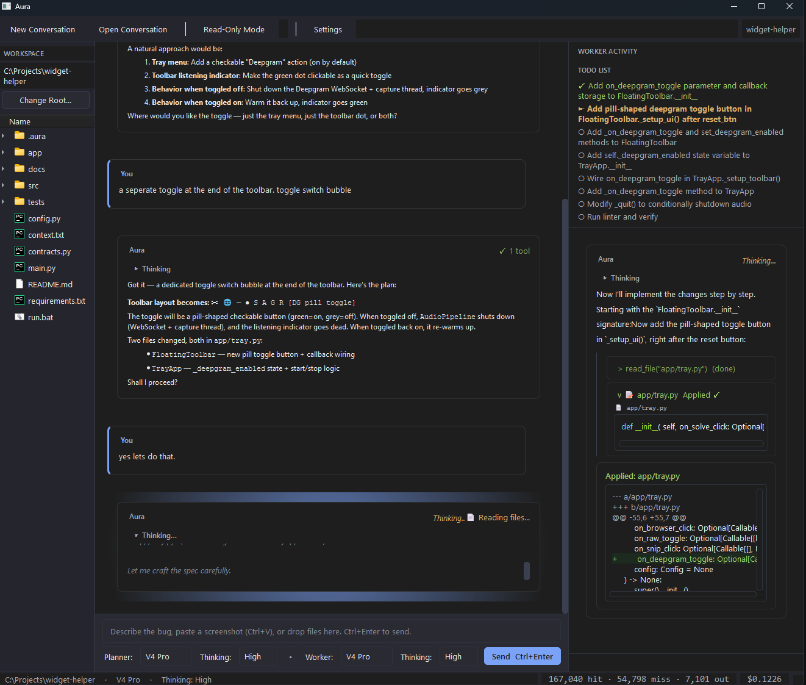

# Aura


**Desktop AI Orchestration IDE**

Aura is a desktop chat application that helps you troubleshoot and modify your codebase. You chat with an AI agent that can read your project files, search your codebase, propose code changes, and — when you approve — apply those changes directly to disk. Think of it as a pair programmer that lives on your machine, with full awareness of your project.

It is built with [PySide6](https://pypi.org/project/PySide6/) (Qt for Python) and talks to [DeepSeek's API](https://platform.deepseek.com/) for reasoning and code generation. A local [Ollama](https://ollama.com/) vision model (`llama3.2-vision`) can preprocess screenshots you paste into the chat so the AI can "see" what's on your screen.

## Screenshots

<p align="center">
  
  
</p>

*Left: Main interface with three-pane layout — workspace tree, chat view, and worker activity panel. Right: Diff approval dialog — every file change is reviewed before being applied.*

## Key Features

- **Planner / Worker Architecture** — A two-agent system: the *Planner* reads your codebase, reasons about changes, and writes precise technical specs. The *Worker* executes those specs with read/write filesystem access, subject to your approval.
- **Filesystem Tools** — `read_file`, `list_directory`, `glob`, and `grep_search` let the AI explore your workspace before answering — no guessing.
- **Safe File Editing** — `write_file` and `edit_file` (surgical string replacement) show a side-by-side diff dialog before any bytes touch disk. You approve or reject every change.
- **Read-Only Mode** — Toggle a toolbar button to lock out all write tools. The AI can still read and advise, but cannot modify code.
- **Web Research Agent** — `run_research` dispatches a background sub-agent that searches the web and returns a synthesized report. Great for looking up documentation or debugging unfamiliar errors.
- **Terminal Commands** — `run_terminal_command` runs linters, test suites, type checkers, or installers in your workspace, with live-streamed output.
- **Vision Preprocessing** — Paste screenshots (`Ctrl+V`) or drag-and-drop images into the chat. A local Ollama vision model describes them in detail so the AI can reason about visual content.
- **Git Integration** — Worker file changes are auto-committed with AI-generated commit messages. The `/undo` command soft-resets the last commit.
- **Conversation Persistence** — Chats are saved to `.aura/conversations/` in your workspace. Restore your last session, open past conversations, or start fresh.
- **Session Cost Tracking** — A live status bar shows tokens used (cache hit, cache miss, output) and estimated cost in USD, broken down by model.
- **Thinking Modes** — Choose Off, High, or Max reasoning depth for each model independently (Planner and Worker can use different settings).
- **Dual Model Support** — DeepSeek V4 Flash (fast, economical) and DeepSeek V4 Pro (more capable), assignable independently to Planner and Worker.

## Installation

### Prerequisites

- **Python 3.10** or later
- A [DeepSeek API key](https://platform.deepseek.com/) exported as `DEEPSEEK_API_KEY`
- (Optional) [Ollama](https://ollama.com/) running locally with `llama3.2-vision` for screenshot preprocessing

### Install via pip

```bash
pip install -e .
```

Or, once published:

```bash
pip install aura
```

### Set your API key

```bash
export DEEPSEEK_API_KEY="sk-..."
```

On Windows, set it via **System Properties → Environment Variables**.

### Launch

```bash
aura
```

Or:

```bash
python -m aura
```

## Usage

### Basic workflow

1. Launch Aura and select your project folder as the workspace root (or it defaults to the current directory).
2. Type a question or request in the input panel — describe a bug, ask for an explanation, or request a change.
3. The **Planner** reads relevant files, asks clarifying questions if needed, then writes a spec and calls `dispatch_to_worker`.
4. A **Spec Card** appears in the chat. Review it (you can edit the spec if needed), then click **Dispatch**.
5. The **Worker** runs, reads the target files, and proposes edits. Each write pops up a diff dialog for your approval.
6. When the Worker finishes, it reports a summary back to the Planner, and the conversation continues.

### Keyboard shortcuts

| Shortcut | Action |
|----------|--------|
| **Ctrl+Enter** | Send message |
| **Ctrl+V** (in editor) | Paste image from clipboard |

### Slash commands

| Command | Description |
|---------|-------------|
| `/undo` | Soft-resets the last git commit (if your workspace is a git repo). Use this to quickly revert the AI's last change. |

### Model & thinking selection

Use the dropdowns in the input panel to pick:

- **Planner Model** — Reads code and writes specs (V4 Flash or V4 Pro)
- **Planner Thinking** — Reasoning depth (Off / High / Max)
- **Worker Model** — Executes file edits (typically V4 Pro for complex changes)
- **Worker Thinking** — Reasoning depth for the worker

### Attachments

- **Paste images** (`Ctrl+V`) — screenshots of errors, UI, or diagrams
- **Drag-and-drop files** — images get base64-encoded and sent through vision preprocessing; other files are attached as path references

## Architecture

Aura uses a decoupled architecture with Qt signals/slots bridging synchronous AI conversation logic to the async GUI:

```
┌──────────────┐     ┌──────────────┐     ┌──────────────────┐
│   GUI Layer  │ ←→  │ Bridge Layer │ ←→  │ Conversation     │
│  (PySide6)   │     │ (QThread)    │     │ Layer (sync)     │
│              │     │              │     │                  │
│ MainWindow   │     │ ConvBridge   │     │ ConvManager      │
│ ChatView     │     │ _Worker      │     │ History          │
│ InputPanel   │     │ _ApproveProxy│     │ ToolRegistry     │
│ WorkspaceTree│     │ _DispatchProxy│    │ Persistence      │
│ WorkerWindow │     │              │     │                  │
└──────────────┘     └──────────────┘     └──────────────────┘
```

See [`docs/ARCHITECTURE.md`](docs/ARCHITECTURE.md) for a detailed walkthrough.

## Configuration

Settings are stored in `~/.config/Aura/config.json` (or the platform-appropriate equivalent via `platformdirs`). You can adjust all defaults through the **Settings** dialog (toolbar gear icon):

- Default planner/worker models and thinking modes
- Planner/Worker mode toggle
- Restore last conversation on launch
- Vision preprocessing (enable/disable, model, endpoint)

## Dependencies

| Package | Purpose |
|---------|---------|
| [PySide6](https://pypi.org/project/PySide6/) | Qt for Python GUI |
| [openai](https://pypi.org/project/openai/) | DeepSeek API client (OpenAI-compatible endpoint) |
| [pydantic](https://pypi.org/project/pydantic/) | Data validation |
| [platformdirs](https://pypi.org/project/platformdirs/) | Cross-platform config/data directories |
| [Pillow](https://pypi.org/project/Pillow/) | Image handling for pasted screenshots |
| [Pygments](https://pypi.org/project/Pygments/) | Syntax highlighting in diff dialogs |
| [httpx](https://pypi.org/project/httpx/) | HTTP client for web research |
| [ddgs](https://pypi.org/project/ddgs/) | DuckDuckGo search for web research |
| [beautifulsoup4](https://pypi.org/project/beautifulsoup4/) | HTML parsing for web research |

## Project Structure

```
aura/
├── __init__.py              # Package version
├── __main__.py              # Entry point
├── config.py                # Settings, models, pricing
├── git.py                   # Auto-commit & /undo
├── vision.py                # Ollama vision client
├── bridge/                  # Qt thread bridge
│   ├── __init__.py
│   └── qt_bridge.py         # ConversationBridge, _Worker, _DispatchProxy
├── client/                  # DeepSeek API client
│   ├── __init__.py
│   ├── deepseek.py
│   └── events.py
├── conversation/            # Synchronous conversation logic
│   ├── __init__.py
│   ├── manager.py           # ConversationManager (tool loop)
│   ├── history.py           # Message history
│   ├── dispatch.py          # Worker dispatch types
│   ├── persistence.py       # Save/load conversations
│   └── tools/               # Tool implementations
│       ├── __init__.py
│       ├── registry.py      # ToolRegistry & tool definitions
│       ├── fs_read.py       # read_file, list_directory, glob
│       ├── fs_write.py      # write_file, edit_file
│       ├── grep.py          # grep_search
│       ├── web.py           # web_search, web_fetch
│       └── backup.py        # Timestamped backups before writes
└── gui/                     # PySide6 UI components
    ├── __init__.py
    ├── main_window.py       # MainWindow, toolbar, status bar
    ├── chat_view.py         # Chat transcript with cards
    ├── input_panel.py       # Message composer, attachments
    ├── workspace_tree.py
    ├── worker_window.py     # Worker progress viewer
    ├── planner_log.py       # Planner reasoning log viewer
    ├── diff_dialog.py       # Diff approval modal
    ├── spec_edit_dialog.py
    ├── settings_dialog.py
    ├── theme.py             # Dark theme constants
    └── aura_widget.py       # Animated "Aura" dots
```

## License & Credits

Aura is a personal/indie project. Built with ❤️ for developers everywhere.

The application icon is located at [`media/AurA.ico`](media/AurA.ico).
