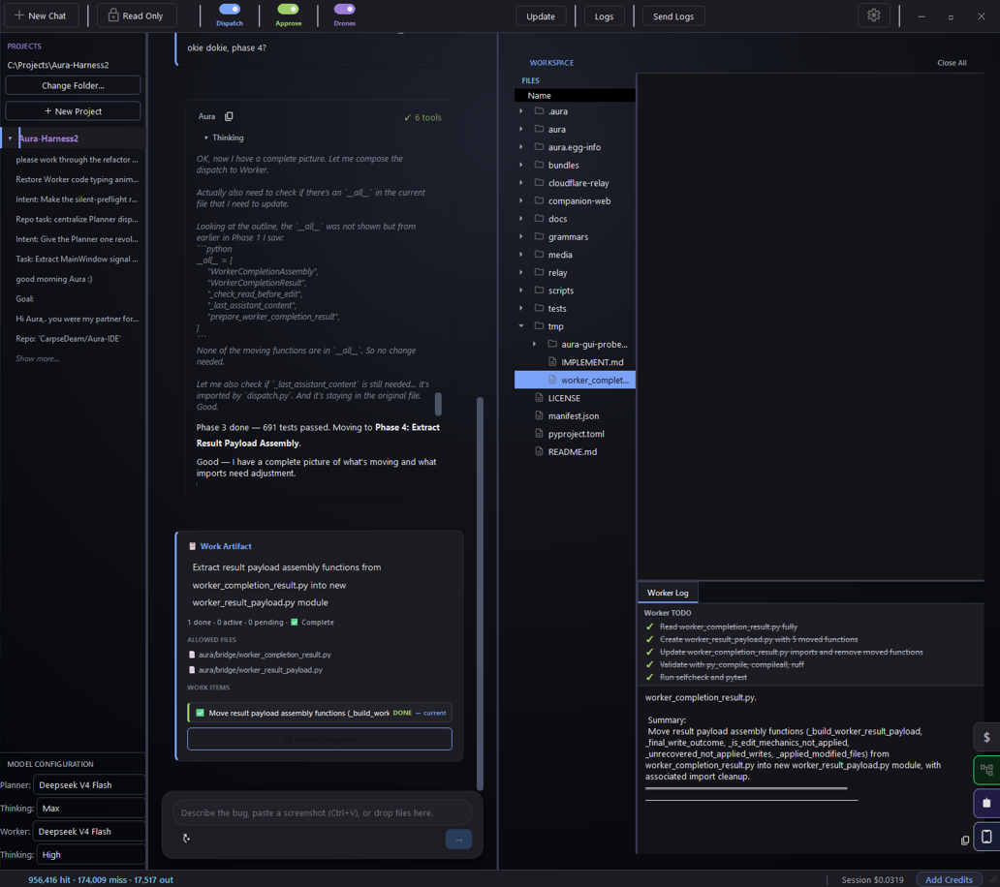
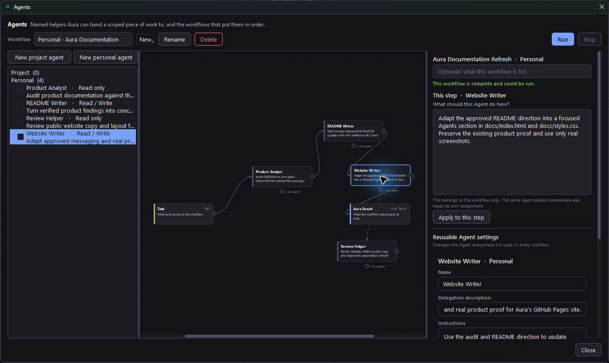
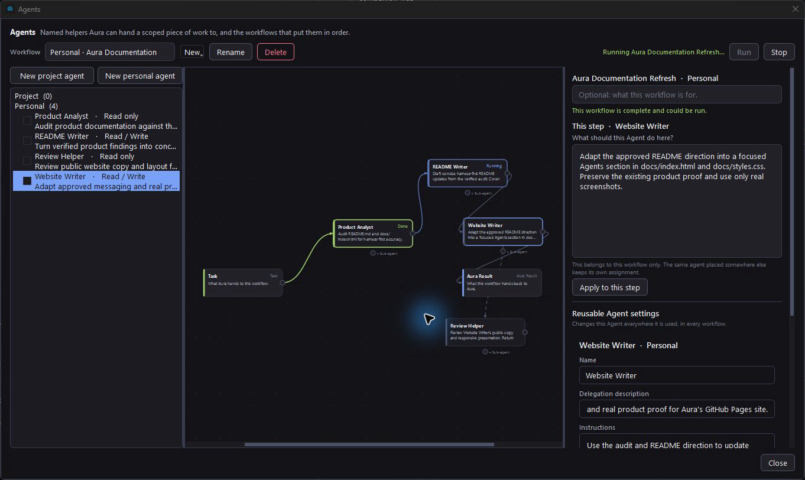
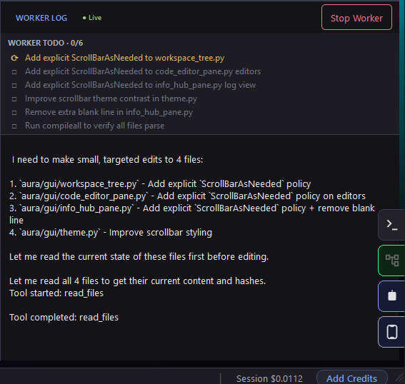
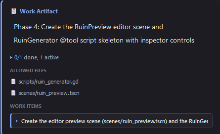
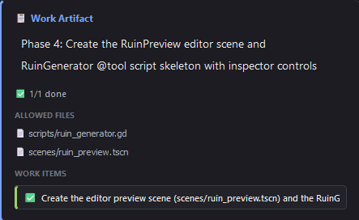
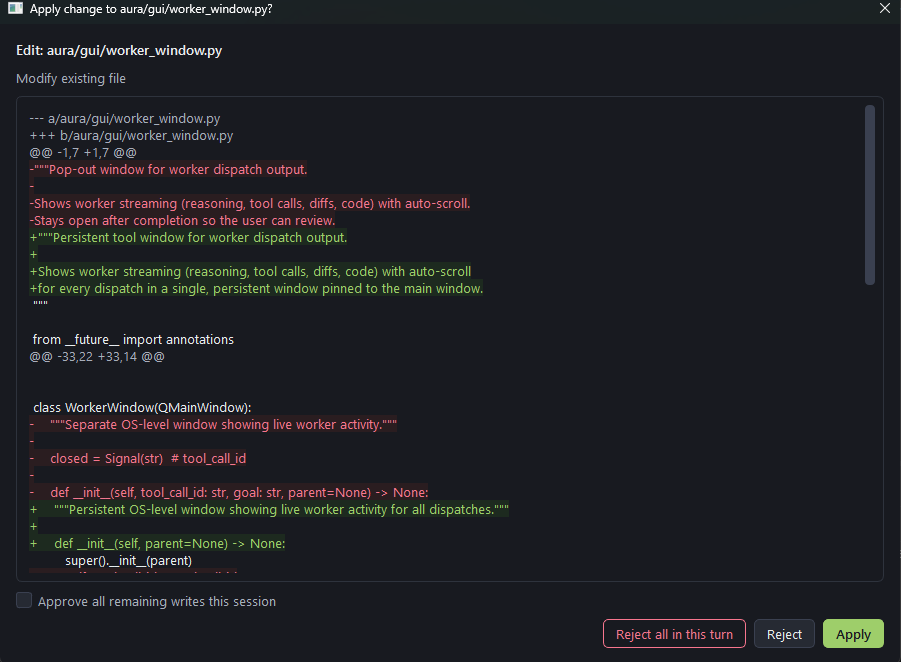

# Aura IDE

[](https://www.python.org/)
[](LICENSE)
[](https://github.com/CarpseDeam/Aura-IDE/releases/latest)
[](https://discord.gg/aGSthBX2Bg)

**Bring any model. Aura makes it plan, prove, and validate its work.**

Aura is an open-source desktop coding harness. Aura turns AI coding into a visible loop: inspect the work, review the diff, run validation, keep the receipt.

**Chat is where the model talks. Aura is where the model works.** Aura owns the root conversation and final response. It can complete work directly or use your reusable Agents and workflows while keeping tools, diffs, validation, and the final receipt visible.

[Website](https://carpsedeam.github.io/Aura-IDE/) · [Download](https://github.com/CarpseDeam/Aura-IDE/releases/latest) · [Start Here](https://aura-ide.hashnode.dev/start-here) · [Documentation](docs/README.md) · [Discord](https://discord.gg/aGSthBX2Bg) · [Blog](https://aura-ide.hashnode.dev/)

<p align="center">
  
</p>

<p align="center"><em>Completed work remains inspectable — keep the completion receipt.</em></p>

## The visible loop

```text
Ask → Inspect → Execute → Review → Validate → Done
```

- **Ask** — Describe the change in plain language.
- **Inspect** — Aura reads the workspace and builds task context, directly or through a bounded Agent step.
- **Execute** — Aura owns TODO progress and can work directly or coordinate a reusable workflow.
- **Review** — Proposed writes appear as readable diffs.
- **Validate** — Aura runs checks suited to the project and changed files. Failures remain visible and clearly reported.
- **Done** — Completed work leaves an inspectable receipt.

Aura remains the stable root owner for every turn. Agent work stays inside Aura's permissions, isolated worktrees, review, validation, and retained-change lifecycle.

## Agents and visual workflows

Agents are a major harness capability, not a separate product. Each Agent is a reusable identity with its own instructions, model target, thinking level, and private Read only or Read / Write permissions. An Agent can inherit Aura's provider and model or target any configured hosted or local model. Place an Agent in a workflow to give that occurrence a concise assignment while keeping the reusable identity intact.

Describe the process to Aura: **“Create a reusable Workflow that implements a requested change, tests it, then reviews it.”** Aura saves a personal Workflow and shows its native graph in chat, with **Run**, **Open Workflow**, and **Undo** after an edit. Refine it conversationally: **“Add a security review before the final result.”** The same Workflow is updated; models inherit Aura's current model by default, and shared Agent definitions stay intact. Expand **Details** to inspect assignments, models, and permissions.

Setup works with the Agents switch off and does not execute anything. Click the card's **Run** and supply a task such as “Add password reset”; the saved process can then run again for a different task. Chat previews are session-local, while the Workflow remains in the ordinary library and canvas. Read Only and Plan Review also govern conversational edits.

<p align="center">
  
</p>

- **Solid lines** are the ordering contract from Task through Agent steps to Aura Result. Independent ready read-only Steps may overlap against the same stable workspace view. A Step with Read / Write authority—or a Read / Write descendant anywhere in its helper tree—runs exclusively, so readers never overlap writers and writers never overlap each other. A Step that must consume another Step's edits must be connected as its successor. Joins wait for every predecessor to settle successfully, and results remain in frozen workflow order rather than completion order.
- **Dashed Sub-agent lines** form optional helper trees without inserting them into the automatic path. Each Step or helper may invoke only its directly attached helpers, synchronously, under each occurrence's own frozen permission.
- **Run** explicitly executes the open workflow; **Stop** remains available while it runs.
- The **Agents toolbar toggle** lets Aura assemble a team or choose a runnable saved Workflow during an ordinary conversation. Opening a Workflow in the editor does not bind chat to it; the card's **Run** requests that exact Workflow for one fresh turn without changing the toggle.
- **Read / Write work is isolated** and is never applied automatically. Aura returns structured results and retains proposed changes for explicit review and application.

<p align="center">
  
</p>

Aura still owns the conversation and final answer: it can do the work itself or delegate bounded steps, then receive the workflow's structured result inside the same visible harness loop.

## Product proof

These are real states from the current Aura desktop workflow.

### Watch bounded work advance live

<p align="center">
  
</p>

Task Checklist and Execution Log expose the active item, tool activity, progress, and session status while the job runs.

### Keep file scope visible

<p align="center">
  
  
</p>

The WorkArtifact retains the job, allowed files, and item state from active execution through completion.

### Review every proposed change

<p align="center">
  
</p>

The completed cockpit shown at the top keeps the WorkArtifact, Task Checklist, files, validation outcome, and completion receipt inspectable after the run.

## Quick start

### Windows installer

Download the latest `.exe` from [GitHub Releases](https://github.com/CarpseDeam/Aura-IDE/releases/latest). Aura installs per user, requires no administrator rights, and handles Windows application updates in-app.

### From source

Use the source install on macOS, Linux, or Windows with Python 3.10 or newer:

```bash
git clone https://github.com/CarpseDeam/Aura-IDE.git
cd Aura-IDE
pip install .
aura
```

### First run

1. Open a workspace.
2. Configure a hosted provider in Settings → API Keys, or discover a local model in Settings → Models.
3. Ask for a small task such as `fix a typo in README.md`.
4. Review proposed diffs and visible validation results.
5. Inspect the completion receipt.

See [Getting Started](docs/getting-started.md) for onboarding, model setup, shortcuts, and the full first-run walkthrough.

## Built with Aura

Aura wrote most of itself through the same harness loop. From May to June 2026, it processed **2+ billion DeepSeek tokens** across nearly **30,000 API requests** while building its own codebase.

These figures are supporting evidence for sustained harness-driven development—not the product pitch by themselves.

<p align="center">
  
  
</p>

## Why Aura is different

- **One root conversation owner** — Aura receives the real request, coordinates direct or delegated work, and owns the final response and receipt.
- **Repo-aware context** — language-aware code intelligence, local BM25 search, dependency context, project metadata, and targeted file reads give the agent more than the latest chat message.
- **WorkArtifact projection** — active work remains inspectable through the existing TODO, activity, tool, validation, and receipt surfaces.
- **Reviewable diffs** — proposed file writes can be inspected and approved before they reach disk.
- **Project-aware validation** — Aura detects project tooling, selects focused checks for changed files, and reports results without hiding failures.
- **Inspectable receipts** — completed runs retain tool, file, validation, cost, and outcome information as an audit record; receipt status does not drive internal item state.
- **Provider flexibility** — choose a supported BYOK provider or OpenAI-compatible local model for production work, then mix targets across Agents.
- **Local-first control** — the desktop owns the real workspace, execution, keys, and approval surface.

### The harness effect

Lower-cost models become more useful when the workflow supplies planning, scope, review, validation, and receipts. Stronger models benefit from the same control surface. The model changes; the visible loop stays consistent.

## Safety and control

Aura treats model-generated changes like a teammate's pull request. The controls are concrete and configurable:

- **Diff approval** — write tools produce a unified diff before mutation when approval is enabled. Approve or reject one change, or handle the remaining batch together.
- **Automatic backups** — existing files are copied to `.aura/backups/` before write operations.
- **Read-only mode** — write tools are removed from the model's tool list at the registry level.
- **Bounded scope** — WorkArtifacts keep the current item and allowed files visible.
- **Visible validation** — commands, outcomes, missing tools, and failures remain available for inspection.
- **Git safety tools** — status, diff, commits, snapshots, restore support, and `/undo` are built into the workflow.
- **Encrypted API keys** — saved keys use machine-derived Fernet encryption; environment variables are also supported.

These controls reduce risk, but they do not replace reviewing the plan, diffs, and validation output. See [Safety & Control](docs/safety.md) for details.

## Aura Companion

**Your phone steers Aura. Your desktop does the work.**

Companion is a remote control, not a separate IDE. The desktop owns the workspace and execution; the phone can browse projects and conversations, send messages, and follow live execution.

<p align="center">
  
  
</p>

Enable Companion on the desktop, pair from the phone browser, and connect through a local or hosted relay. The desktop must remain running. See [Mobile Companion](docs/mobile.md) for setup and connection details.

## Providers

Aura works with user-configured AI providers. Connect directly to **DeepSeek**, **OpenAI**, **Anthropic**, **Gemini**, or **OpenRouter**, or point Aura at an OpenAI-compatible local server such as Ollama, LM Studio, or llama.cpp. Hosted keys can be supplied through Settings or environment variables; local models remain inside Aura's same tools, diffs, validation, and Agent workflow.

See [Providers](docs/providers.md) for supported backends and configuration details.

## Advanced capabilities

- **Repo-aware code intelligence** — language-aware outlines, symbol and reference lookup, project structure, and a local BM25 code index.
- **Dependency context** — reverse-reference and dependency hints help define the likely blast radius of a change.
- **Project-aware validation** — project profiles, syntax probes, focused terminal checks, and changed-file context guide validation.
- **Run-and-watch verification** — start a process, observe its output over a bounded window, and retain the result.
- **Git integration** — status, diff, commit, snapshots, restore support, `/undo`, and automatic `.aura/` ignore setup.
- **Provider-native web search** — the selected production provider and model own hosted search in the same request when their current transport supports it; unsupported combinations omit search without switching providers.
- **Reusable Agents and workflows** — describe and refine a saved Workflow in chat, or compose permissioned specialists on the canvas with branches, joins, and optional helper trees.
- **MCP integration** — connect stdio Model Context Protocol servers and expose their tools through Aura's tool registry.
- **Update support** — packaged Windows builds support in-app updates, while source checkouts can inspect upstream update state.

The [documentation index](docs/README.md) links to architecture, tools, providers, configuration, safety, Companion, and development references.

## Community and support

- [Website](https://carpsedeam.github.io/Aura-IDE/) — the short product tour and current visual workflow.
- [Documentation](docs/README.md) — installation, architecture, tools, providers, safety, and development guides.
- [Blog](https://aura-ide.hashnode.dev/) — build logs, design notes, and project updates.
- [Discord](https://discord.gg/aGSthBX2Bg) — help, bug reports, feedback, and show-and-tell.
- [GitHub Issues](https://github.com/CarpseDeam/Aura-IDE/issues) — reproducible bugs and feature requests.

Aura is free and open source. If it is useful to you, support helps cover infrastructure, packaging, and continued development:

[GitHub Sponsors](https://github.com/sponsors/CarpseDeam) · [Buy Me a Coffee](https://buymeacoffee.com/snowballkori)

MIT License — see [LICENSE](LICENSE).
